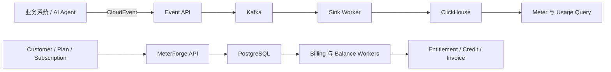

<div align="center">


# MeterForge

**把 AI 与软件服务的每一次使用，转换成可查询的用量、可执行的额度和可结算的账单。**

[快速体验](#快速体验) · [产品闭环](#产品闭环) · [AI-Token-实验](#ai-token-实验) · [项目结构](#项目结构) · [来源与许可](#来源与许可)

</div>

## 这个项目解决什么问题

许多 AI、Agent、API 和开发者工具都能记录调用日志，但真正商业化时还需要回答一组连续的问题：

- 某个 Customer 实际使用了多少？
- 用量属于哪个 Workspace、User 或 API Key？
- 当前套餐允许继续使用吗？
- 免费额度、预付 Credits 和超额费用如何结算？
- 套餐升级、取消和账单周期变化后，历史数据如何保持一致？

MeterForge 将这些问题组织成一条完整链路：

```text
Event → Meter → Usage → Feature → Plan
      → Customer → Subscription → Entitlement
      → Credit → Invoice
```

它不是 LLM Provider，也不生成模型回答。它位于业务系统之后，接收真实使用事件并负责计量、额度、订阅和账单。

## 你可以用它完成什么

| 场景 | MeterForge 中的处理方式 |
| --- | --- |
| LLM / VLM Token | 按 prompt、completion 或 total Token 聚合 |
| Embedding、Rerank | 按 Token、字符数或调用次数计量 |
| ASR | 按音频秒数或分钟数计量 |
| API 与 Agent | 按请求、工具调用或任务执行次数计量 |
| SaaS 套餐 | 管理 Plan、Subscription、Feature 与额度 |
| 预付费 | 发放和消耗付费或赠送 Credits |
| 后付费 | 根据已计量用量生成 Invoice |

## 快速体验

### 1. 启动本地环境

需要 Docker 与 Docker Compose。

```bash
git clone https://github.com/Pototoooo/meterforge.git
cd meterforge/quickstart
docker compose up -d
```

启动后：

- Console：<http://127.0.0.1:3000>
- API：<http://127.0.0.1:48888>

停止服务：

```bash
docker compose down
```

默认不会执行 `down -v`，因此本地数据卷会保留。

### 2. 按业务顺序体验

第一次使用建议不要从源码开始，按下面的顺序操作：

1. 创建 Meter，定义“什么算一次用量”。
2. 发送 Event，模拟业务系统产生使用记录。
3. 查看 Usage，确认事件被正确聚合。
4. 创建 Feature 与 Plan，定义销售内容和计价规则。
5. 创建 Customer 与 Subscription，建立客户合同关系。
6. 查看 Entitlement、Credit 与 Invoice，验证额度和结算结果。

## AI Token 实验

不需要真实模型 API，也可以测试 Token 计量。

先在 Console 创建 Meter：

| 配置项 | 值 |
| --- | --- |
| Key | `tokens_total` |
| Event type | `prompt` |
| Aggregation | `SUM` |
| Value property | `$.tokens` |
| Group by | `model`、`type` |

然后发送一条虚拟用量 Event：

```bash
curl -X POST http://127.0.0.1:48888/api/v1/events \
  -H 'Content-Type: application/cloudevents+json' \
  --data-raw '{
    "specversion": "1.0",
    "id": "demo-token-0001",
    "source": "meterforge-readme",
    "type": "prompt",
    "subject": "workspace:demo",
    "time": "2026-08-07T00:00:00Z",
    "data": {
      "tokens": 1200,
      "model": "mock-llm",
      "type": "total"
    }
  }'
```

这条 Event 只模拟一次已发生的模型调用，不会请求任何 LLM，也不会产生 Provider 费用。等待异步消费完成后，可以在 Console 中查看 `workspace:demo` 的聚合用量。

真实接入时，应由业务系统在模型调用结束并取得 Usage 后自动发送 Event，而不是让用户手工填写。

## 系统如何分工



- ClickHouse 保存和聚合高频使用事件。
- PostgreSQL 保存客户、套餐、订阅、额度和账单等业务状态。
- Kafka 与 Worker 将实时接入和后续处理解耦。
- TypeSpec 作为 API 定义来源，并生成 OpenAPI 与 SDK 代码。

## 项目结构

```text
cmd/                    服务入口
meterforge/             核心领域与业务逻辑
meterforge/ent/schema/  数据模型定义
api/spec/               TypeSpec API 定义
api/                    OpenAPI、服务端类型与 SDK
web/                    本地管理 Console
quickstart/             Docker Compose 快速体验环境
deploy/                 Kubernetes 部署资源
docs/                   架构与开发文档
```

常用开发入口：

```bash
make up       # 启动依赖
make server   # 启动 API 服务
make test     # 运行根 Go module 测试
make lint     # 运行检查
make build    # 构建服务
```

生成代码请从 TypeSpec、Ent Schema 等源文件修改后重新生成，不要直接编辑带有 `Code generated` 标记的文件。

## 当前仓库定位

这个仓库用于研究和实现以下方向：

- 面向 AI / Agent 产品的 Token 与多模态用量计量。
- Subscription、Entitlement、Credit 与 Invoice 的业务闭环。
- 本地 Console 的中文化与自托管体验。
- Event 幂等、异步消费、余额控制和计费一致性。

仓库包含完整后端、Console、API 定义和 SDK 源码，但不承诺已经向 npm、PyPI 或其他公共 Registry 发布同名软件包。当前推荐使用 Docker Compose 在本地体验。
